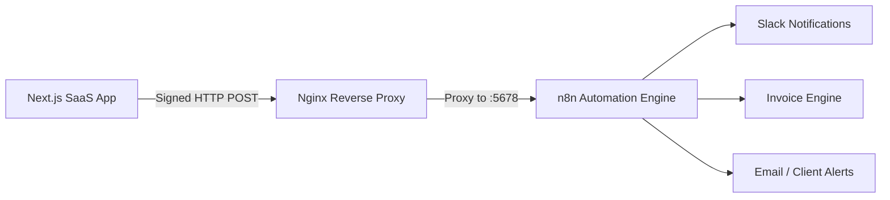

# N8N Automation Architecture & Webhook Contracts

## 1. Overview & Architecture

This document formalizes the event-driven contract between the SaaS application and the self-hosted **n8n** automation engine running on the Contabo VPS.



### Key Principles
1. **Outbound Signed Event Emitter**: The application is the authoritative source of business events. When critical entity state transitions occur, the application emits a signed webhook payload to the organization's configured n8n endpoint.
2. **Organization-Level Isolation**: Each tenant organization can configure its own `automation_webhook_url` and `automation_webhook_secret` in `public.organizations`. Platform-wide defaults fallback to `N8N_WEBHOOK_URL` and `N8N_WEBHOOK_SECRET`.
3. **HMAC-SHA256 Verification**: Every payload is signed with a cryptographic HMAC using the shared secret. n8n workflows verify this signature before executing downstream actions.
4. **Idempotency**: Every delivery includes a unique `X-Automation-Delivery` UUID and ISO timestamp to protect against replay attacks.

---

## 2. HTTP Request Specification

### Webhook Headers
| Header | Description | Example |
| :--- | :--- | :--- |
| `Content-Type` | MIME type (always JSON) | `application/json` |
| `X-Automation-Event` | Canonical event name | `project.delivered` |
| `X-Automation-Signature` | HMAC-SHA256 hex digest | `sha256=9f86d081884c7d659a2feaa0c55ad015a3bf4f1b2b0b822cd15d6c15b0f00a08` |
| `X-Automation-Delivery` | Unique delivery UUID | `d290f1ee-6c54-4b01-90e6-d701748f0851` |
| `X-Automation-Timestamp` | Event creation ISO timestamp | `2026-09-18T14:30:00.000Z` |

---

## 3. The 4 Core Automation Flows

### Flow 1: Project Delivered → Invoice Trigger (`project.delivered`)
- **Trigger**: Project status changes to `Delivered` in `/projects/[id]` or the Kanban board (`/projects/kanban`).
- **Target n8n Workflow**: Generates final invoice or draft in Stripe/accounting, notifies billing team, and posts delivery announcement to Slack `#agency-announcements`.

#### Payload Schema
```json
{
  "id": "c71a3962-9e8c-4f71-a477-802dcbeaa250",
  "event": "project.delivered",
  "organization_id": "7f1396b2-031e-450a-bc0c-145c2250ea11",
  "timestamp": "2026-09-18T14:30:00.000Z",
  "data": {
    "project_id": "9b1deb4d-3b7d-4bad-9bdd-2b0d7b3dcb6d",
    "project_name": "E-Commerce Re-platforming",
    "client_id": "4a713962-8e8c-4f71-a477-802dcbeaa299",
    "client_name": "Acme Global Industries",
    "client_email": "billing@acmeglobal.com",
    "budget": 24500.00,
    "delivered_at": "2026-09-18T14:30:00.000Z",
    "completed_by_id": "11111111-2222-3333-4444-555555555555",
    "completed_by_name": "Sarah Connor",
    "completed_by_email": "sarah@agency.com"
  }
}
```

---

### Flow 2: Task Deadline Approaching (`task.deadline_approaching`)
- **Trigger**: Scheduled check detects tasks due within the next 24 hours.
- **Target n8n Workflow**: Sends direct reminder to assignee on Slack/Email with task link.

#### Payload Schema
```json
{
  "id": "e81a3962-9e8c-4f71-a477-802dcbeaa251",
  "event": "task.deadline_approaching",
  "organization_id": "7f1396b2-031e-450a-bc0c-145c2250ea11",
  "timestamp": "2026-09-18T08:00:00.000Z",
  "data": {
    "task_id": "8f1a3962-9e8c-4f71-a477-802dcbeaa211",
    "task_title": "Finalize Q3 Security Audit Deliverables",
    "project_id": "9b1deb4d-3b7d-4bad-9bdd-2b0d7b3dcb6d",
    "project_name": "E-Commerce Re-platforming",
    "due_date": "2026-09-19T17:00:00.000Z",
    "priority": "high",
    "assignee_id": "11111111-2222-3333-4444-555555555555",
    "assignee_name": "Sarah Connor",
    "assignee_email": "sarah@agency.com"
  }
}
```

---

### Flow 3: Project Overdue Alert (`project.overdue`)
- **Trigger**: Project passes its target deadline without reaching `Delivered` or `Completed`.
- **Target n8n Workflow**: Notifies project manager and agency leads in Slack `#project-alerts`.

#### Payload Schema
```json
{
  "id": "f91a3962-9e8c-4f71-a477-802dcbeaa252",
  "event": "project.overdue",
  "organization_id": "7f1396b2-031e-450a-bc0c-145c2250ea11",
  "timestamp": "2026-09-18T09:00:00.000Z",
  "data": {
    "project_id": "9b1deb4d-3b7d-4bad-9bdd-2b0d7b3dcb6d",
    "project_name": "Mobile Banking UI Kit",
    "client_id": "4a713962-8e8c-4f71-a477-802dcbeaa299",
    "client_name": "Horizon Fintech",
    "deadline": "2026-09-17T23:59:59.000Z",
    "days_overdue": 1,
    "status": "In Progress",
    "owner_id": "22222222-3333-4444-5555-666666666666",
    "owner_name": "Alex Miller",
    "owner_email": "alex@agency.com"
  }
}
```

---

### Flow 4: Weekly Summary Ready (`weekly.summary_ready`)
- **Trigger**: Monday morning weekly aggregation job.
- **Target n8n Workflow**: Posts executive recap and AI narrative to Slack `#leadership` or sends executive digest email.

#### Payload Schema
```json
{
  "id": "a11a3962-9e8c-4f71-a477-802dcbeaa253",
  "event": "weekly.summary_ready",
  "organization_id": "7f1396b2-031e-450a-bc0c-145c2250ea11",
  "timestamp": "2026-09-21T08:00:00.000Z",
  "data": {
    "report_id": "4c1deb4d-3b7d-4bad-9bdd-2b0d7b3dcb88",
    "period_start": "2026-09-14T00:00:00.000Z",
    "period_end": "2026-09-20T23:59:59.000Z",
    "metrics": {
      "tasks_completed": 38,
      "active_projects": 14,
      "new_clients": 3,
      "revenue": 52400.00,
      "communication_volume": 128,
      "overdue_items": 2
    },
    "narrative_summary": "### Executive Overview\nStrong momentum this past week with 38 completed deliverables..."
  }
}
```

---

## 4. n8n Signature Verification Code Node

In your n8n workflow, insert a **Code** node immediately following the **Webhook** node to verify authenticity:

```javascript
const crypto = require('crypto');

// 1. Retrieve secret from n8n environment variables
const secret = $env.AUTOMATION_WEBHOOK_SECRET || 'your-shared-secret';

// 2. Extract incoming headers and body
const headers = $input.first().json.headers;
const signatureHeader = headers['x-automation-signature'] || '';
const rawBody = JSON.stringify($input.first().json.body);

if (!signatureHeader) {
  throw new Error('Unauthorized: Missing X-Automation-Signature header');
}

const cleanSignature = signatureHeader.startsWith('sha256=') 
  ? signatureHeader.slice(7) 
  : signatureHeader;

// 3. Compute expected HMAC
const expectedSignature = crypto
  .createHmac('sha256', secret)
  .update(rawBody, 'utf8')
  .digest('hex');

// 4. Timing-safe comparison
const sigBuffer = Buffer.from(cleanSignature, 'hex');
const expectedBuffer = Buffer.from(expectedSignature, 'hex');

if (sigBuffer.length !== expectedBuffer.length || !crypto.timingSafeEqual(sigBuffer, expectedBuffer)) {
  throw new Error('Unauthorized: Invalid HMAC signature');
}

// Verification passed, forward payload
return $input.first();
```

---

## 5. Testing & Verification

- An internal endpoint is available at `/api/automation/events` for local testing and health checks.
- A test event can be emitted via `emitAutomationEvent({ ... })` in `lib/automation/emitter.ts`.
