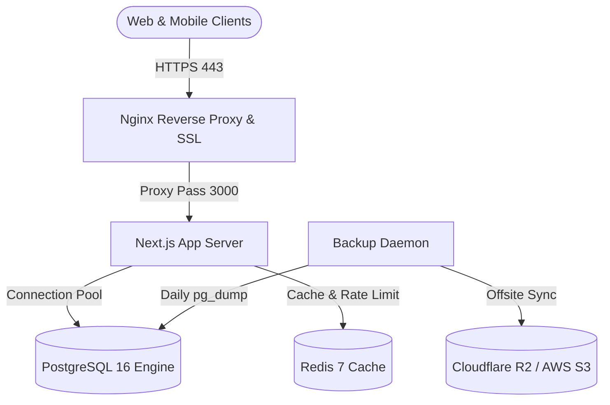

# Innoventix Platform v2 — Production Deployment & Operations Runbook

Comprehensive operational guide for deploying, managing, monitoring, and troubleshooting the self-hosted PostgreSQL and Next.js SaaS architecture on Contabo VPS / Docker / Coolify.

---

## 🏗️ Architecture Overview

The Innoventix SaaS platform runs as a containerized stack:
1. **Application**: Next.js 14 Standalone container (`app:3000`)
2. **Database**: PostgreSQL 16 Alpine with custom memory/WAL tuning (`postgres:5432`)
3. **Cache & Queues**: Redis 7 Alpine with persistent append-only storage (`redis:6379`)
4. **Reverse Proxy**: Nginx with SSL termination, HTTP/2, Gzip, and rate limiting (`nginx:80,443`)
5. **Backup Daemon**: Daily automated compressed dumps with 7-day retention and S3 sync (`backup`)



---

## 🚀 Quick Deployment Guide

### 1. VPS Provisioning & Initial Setup (Contabo VPS)
```bash
# Update server packages
sudo apt update && sudo apt upgrade -y

# Install Docker & Docker Compose
curl -fsSL https://get.docker.com -o get-docker.sh
sudo sh get-docker.sh
sudo usermod -aG docker $USER

# Install UFW firewall
sudo ufw default deny incoming
sudo ufw default allow outgoing
sudo ufw allow 22/tcp    # SSH
sudo ufw allow 80/tcp    # HTTP
sudo ufw allow 443/tcp   # HTTPS
sudo ufw enable
```

### 2. Environment Configuration
```bash
cp .env.production.example .env.production
# Generate cryptographically secure keys
npx ts-node scripts/generate-production-secrets.ts
```

### 3. Start Production Stack
```bash
# Initialize SSL with Certbot
bash infra/certbot/init-ssl.sh

# Run Deployment Pipeline
bash scripts/deploy.sh
```

---

## 🛠️ Operational Tasks & Procedures

### 1. Database Migrations
To run pending migrations against the production database:
```bash
docker compose -f docker-compose.prod.yml exec app npx ts-node scripts/run-migrations.ts
```

### 2. Manual Backup Creation
```bash
# Local compressed backup
bash scripts/backup-db.sh

# Offsite S3 backup
bash scripts/backup-s3.sh
```

### 3. Database Restoration (Disaster Recovery)
```bash
# Restore specific backup snapshot
BACKUP_FILE="./backups/innoventix_backup_YYYYMMDD_HHMMSS.sql.gz" bash scripts/restore-db.sh
```

### 4. Performance Diagnostics
Run the diagnostic SQL suite against the live database:
```bash
docker compose -f docker-compose.prod.yml exec -T postgres psql -U innoventix_user -d innoventix < scripts/tune-postgres.sql
```

---

## 🔍 Troubleshooting Guide

### Issue 1: High CPU / Memory Usage
1. Inspect running containers: `docker stats`
2. Check PostgreSQL active connections:
   ```sql
   SELECT pid, usename, client_addr, state, query_start, query 
   FROM pg_stat_activity 
   WHERE state != 'idle';
   ```
3. Terminate runaway query:
   ```sql
   SELECT pg_terminate_backend(<pid>);
   ```

### Issue 2: Application Returns 503 / 502
1. Verify Next.js health endpoint: `curl http://localhost:3000/api/health`
2. Check application logs: `docker compose -f docker-compose.prod.yml logs -f app`
3. Check Nginx upstream errors: `docker compose -f docker-compose.prod.yml logs -f nginx`

### Issue 3: SSL Certificate Expiry / Renewal Failure
1. Test renewal dry run:
   ```bash
   docker run --rm -it -v innoventix_certbot_etc:/etc/letsencrypt -v innoventix_certbot_www:/var/www/certbot certbot/certbot renew --dry-run
   ```
2. Force reload Nginx:
   ```bash
   docker compose -f docker-compose.prod.yml exec nginx nginx -s reload
   ```
